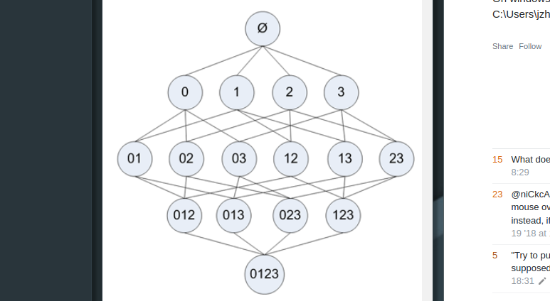
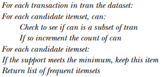
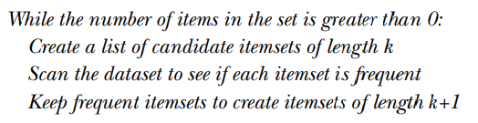

# Association analysis with Apriori algorithm
## Tata Satya Pratheek
### 12th talk S-Lab talk series: ML in Action
---

# Content

- Motivation
- Relevant definitions
- Apriori Algorithm
- Pros & Cons
- Code demonstration
---

# Motivation
- Any institution with active participants generates a lot of data. 
- Not all of genrated data is useful. 
- Trying to find some patterns in this data that leads to a desired outcome for the institution is the point of association analysis. 

---
# Motivation, examples 

- **Employer**: Freshers and roles.
- **Grocery store**: Arranging items and profits.
- **Voter**: Politicians and policies.
- **Blogger**: Blogs and trending keywords.
- **Counter-Terrorist**: Actions and  consequences.
- **Doctor**: Diagnosis and treatment.
- **Lover**: Actions and consequences.
---

# Definitions
- **Frequent itemsets**: Collection of items that occur frequently.
- **Association rules**: Heuristic rule that predicts the association between two items.
- **Association analysis**: Finding frequent itemsets or association rules in large datasets .
---

# Definitions, continued
- **Support of CI**: $\frac{\# sets\supseteq CI }{\# Dataset}$.
- **Confidence of A -> B**: $\frac{support \{A, B\}} {support \{B\}}$.

---

# Apriori Algorithm Principle
>**Apriori principle**: All subsets of a frequent itemset must be frequent.

- **Our implementation's principle**:  If an itemset is infrequent, all its supersets will be infrequent or the contrapositive of the Apriori principle.
---

# Frequent itemsets: Helper functions pseudo code

---
# Frequent itemsets: Pseudocode 

---

# Association rules from frequent itemsets
- **Step 1**: Compute support of each frequent itemset.
- **Step 2**: Set cutoff confidence level.
- **Step 3**: Generate all possible rules from frequent itemsets.
- **Step 4**: Compute confidence of each rule.
- **Step 5**: If rule's confidence $\geq$ cutoff, then add rule to list of rules.
---

# Pros & Cons
- **Pros**: 
 -Easy to code.
 -Works with numeric and nominal values.
 -Determininstic.

- **Cons**:
  -Time and space complexity: $O(2^n)$.
  -Ancient, introduced in 1994.
  -Too simple.
  
---
# References: 
- Machine Learning in Action by Peter Harrington: http://www2.ift.ulaval.ca/~chaib/IFT-4102-7025/public_html/Fichiers/Machine_Learning_in_Action.pdf
- The Numerati by Stephen Baker: https://www.amazon.com/Numerati-Stephen-Baker/dp/B003TO6G20
- Fast Algorithms for mining Association Rules: http://www.vldb.org/conf/1994/P487.PDF   

